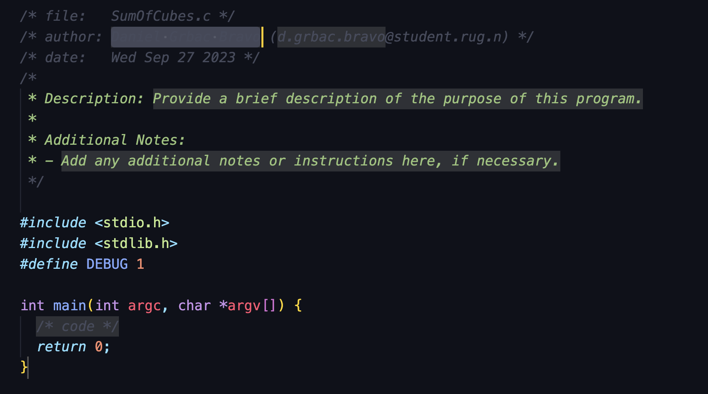

# RUG Snippets

This Visual Studio Code extension, "RUG Snippets", provides a quick and efficient way for the University of Groningen (RUG) students to create file templates in C language. The extension includes templates for file creation adhering to the University's coding standards, thereby saving time and ensuring consistency.

## Features

With just a code snippet, students can generate a boilerplate code for a C program with just a simple trigger of snippet prefix. The snippet includes:

- Filename
- Author's name and email
- Current date
- Brief description of the program
- Standard headers and main function declaration
- Debug macro

The following is an image depicting the extension in action:

## How to Use

1. Install the extension into your VS Code.
2. Open a new file and set the language mode to C.
3. Type "pftemplate" in the new file, and press `Enter`.
4. The snippet will run and generate the C template adhering to the University's coding standard.

You can then substitute your name, email, and a brief description of your program in the predetermined placeholders.

## Extension Settings

Currently, the extension doesn't contribute any settings. It doesn't rely on any specific settings or configuration in VS Code.

## Known Issues

This is the first release. There are currently no known issues. If you stumble upon any issues or wish to see any new features added to the extension, please feel free to submit them on the issues page.

## Release Notes

### 1.0.0

Initial release of RUG Snippets.

---
**Enjoy Programming with RUG Snippets Extension!**